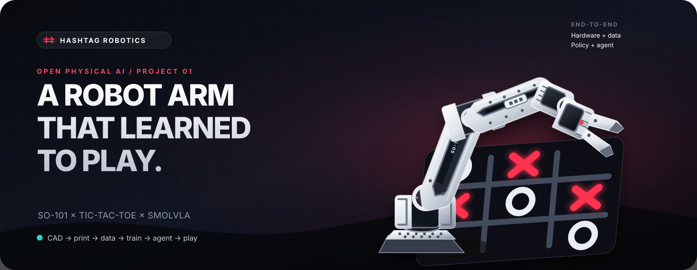
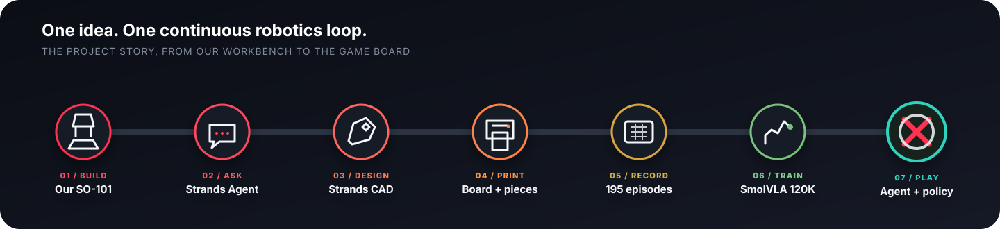
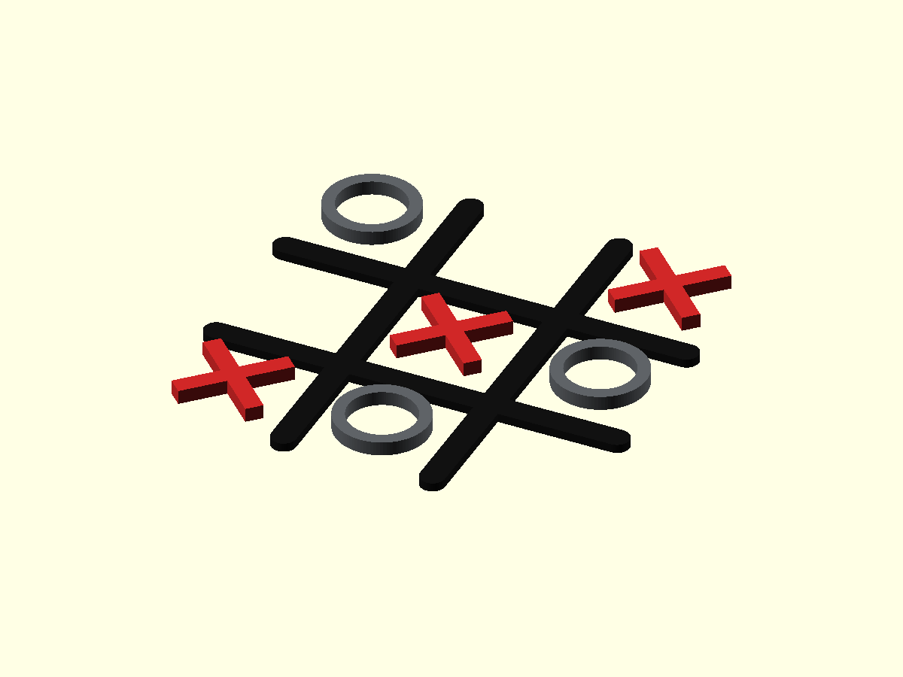
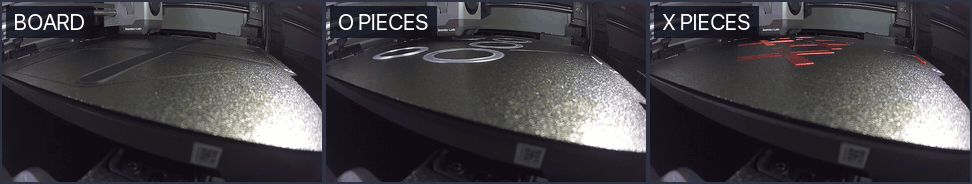
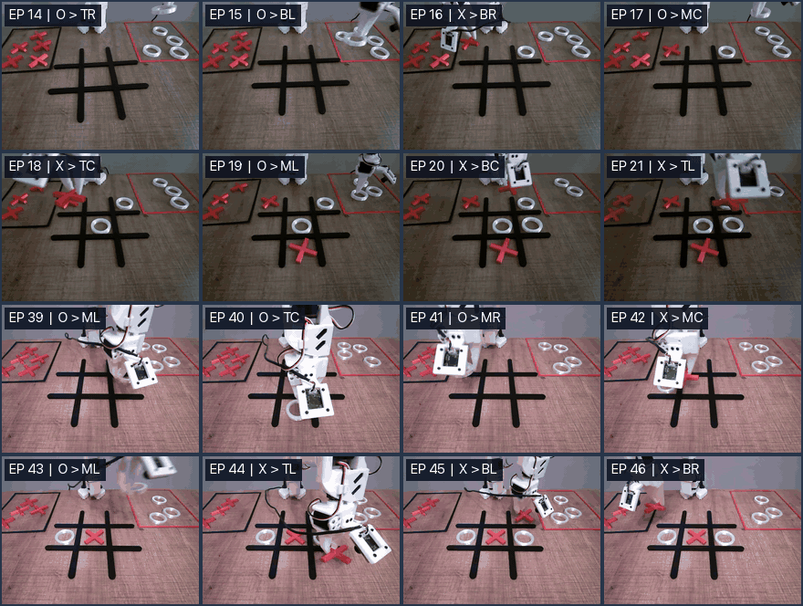
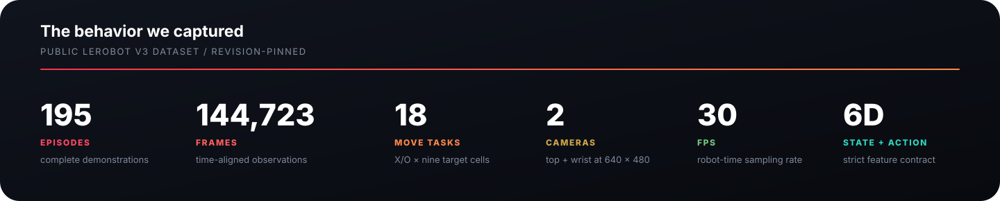
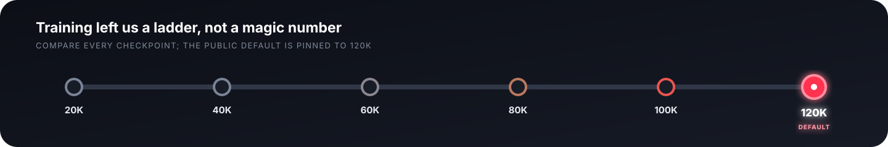
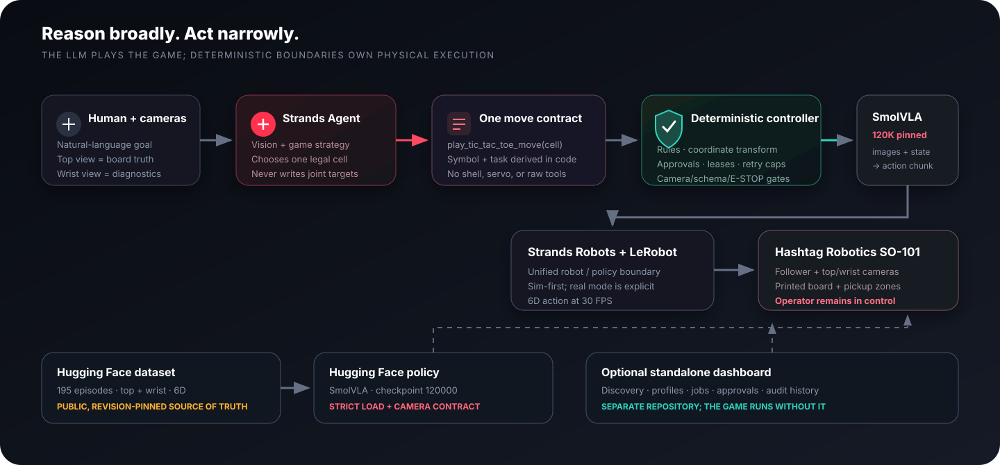
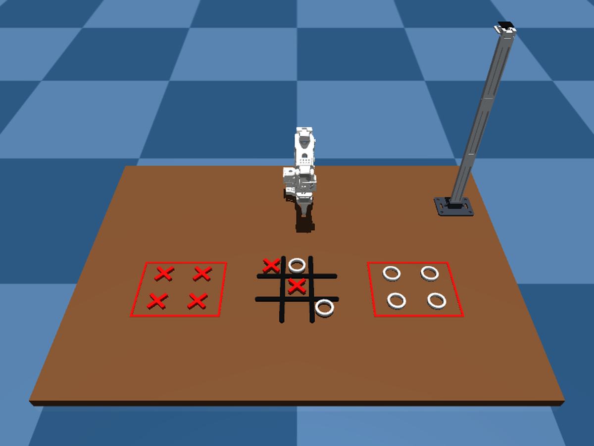

<p align="center">
  
</p>

<h1 align="center">SO-101 Tic-Tac-Toe</h1>

<p align="center">
  <strong>We designed the game, printed it, recorded the behavior, trained the policy, and gave it to an agent.</strong>
</p>

<p align="center">
  An open, end-to-end physical-AI project by <a href="https://hashtagrobotics.tr/"><strong>Hashtag Robotics</strong></a>.
</p>

<p align="center">
  <a href="https://hashtagrobotics.tr/"></a>
  <a href="https://github.com/Hashtag-Robotics/so101-dashboard"></a>
  <a href="https://strandsagents.com/"></a>
  <a href="https://github.com/strands-labs/robots"></a>
</p>

<p align="center">
  <a href="https://huggingface.co/datasets/HashtagRobotics/tic-tac-toe-so101-block-a-clean-v1"></a>
  <a href="https://huggingface.co/HashtagRobotics/smolvla-tic-tac-toe-games-1-15-120k"></a>
  <a href="https://github.com/huggingface/lerobot"></a>
  <a href="LICENSE"></a>
  <a href="hardware/LICENSE"></a>
</p>

<p align="center">
  <a href="#the-story">The story</a> ·
  <a href="#chapter-1--we-built-the-world-first">Print the game</a> ·
  <a href="#chapter-2--we-taught-the-motion">See the dataset</a> ·
  <a href="#chapter-3--we-trained-for-portability">Inspect the model</a> ·
  <a href="#chapter-4--we-gave-the-policy-to-an-agent">Meet the agent</a> ·
  <a href="#reproduce-the-project">Reproduce it</a>
</p>

---

## The story

This project began at a workbench, not in a benchmark.

At Hashtag Robotics, we were using the [SO-101 arms we build](https://labs.hashtagrobotics.tr/so-101-robot-kol-3d)
for pick-and-place experiments. We wanted a task that was immediately legible to
a human but still demanded the entire robotics loop: perception, spatial
reasoning, grasping, placement, turn-taking, and recovery. Tic-tac-toe gave us
all of that in nine cells.

We did not stop at writing a controller for a downloaded prop. We asked a
[Strands Agent](https://strandsagents.com/) to use our **Strands CAD** tool and
turn the idea into printable geometry. We iterated the board, X/O pieces and
pickup zones, sliced them, and printed the physical game. Then we demonstrated
each move with our SO-101 setup, published the resulting LeRobot dataset,
trained a SmolVLA policy, and connected that policy to a vision-capable game
agent.

[Strands Robots](https://github.com/strands-labs/robots) gave the project a
common robotics language across simulation, dataset and policy contracts, and
the guarded path toward real hardware. The result is more than a demo video:
this repository contains the manufacturing files, data lineage, training
recipe, agent runtime, safety boundary, and reproduction path.

<p align="center">
  
</p>

## Chapter 1 — We built the world first

The robot already knew the language of pick-and-place. What it did not have was
a world designed for reliable demonstrations: a large, high-contrast board,
pieces that fit the gripper, loose target cells, and stable pickup zones.

The Strands CAD agent produced an editable, printer-neutral design. The source
of truth is committed here as OpenSCAD and STL; ready-to-print Bambu Lab P2S
jobs are included as conveniences, never as universal G-code.

<p align="center">
  
</p>

| Printed part | Quantity | Finished geometry | Source |
| --- | ---: | --- | --- |
| Hashtag board | 1 | 240 × 240 × 5 mm | [`board.stl`](hardware/tic-tac-toe/stl/board.stl) |
| X token | 6 | 52 × 52 × 8 mm | [`x-token.stl`](hardware/tic-tac-toe/stl/x-token.stl) |
| O token | 6 | 52 × 52 × 8 mm | [`o-token.stl`](hardware/tic-tac-toe/stl/o-token.stl) |
| Pickup-zone frame | 2 | 250 × 200 × 1.2 mm | [`zone-frame.stl`](hardware/tic-tac-toe/stl/zone-frame.stl) |

<p align="center">
  
</p>

<p align="center"><sub>Original Hashtag Robotics printer-camera captures: board, O pieces, and X pieces.</sub></p>

Start with the [printing guide](hardware/tic-tac-toe/PRINTING.md), then use the
[BOM](hardware/tic-tac-toe/BOM.md) and [assembly notes](hardware/tic-tac-toe/ASSEMBLY.md).
The supplied jobs were validated for a Bambu Lab P2S with a 0.4 mm nozzle. If
your printer, nozzle, plate, or material differs, use the STL/source files and
reslice.

The camera tower that established the top and wrist views is published under
[`hardware/camera-tower`](hardware/camera-tower). Its source, STEP/STL/3MF,
profiles, BOM, and assembly notes are included alongside the game.

## Chapter 2 — We taught the motion

A physical game is not learned from rules alone. The policy needed examples of
what every move looks like from the robot's point of view.

We recorded demonstrations for both symbols and all nine target cells. The
published dataset is a LeRobot v3 dataset with synchronized top and wrist video,
robot state, and action. The top camera is the authoritative board view; the
wrist camera explains the grasp and placement up close.

<p align="center">
  <a href="https://huggingface.co/datasets/HashtagRobotics/tic-tac-toe-so101-block-a-clean-v1">
    
  </a>
</p>

<p align="center"><sub>Eight synchronized demonstrations, each shown as an adjacent top + wrist pair. This is a visual sample, not an evaluation or success-rate chart.</sub></p>

<p align="center">
  
</p>

### Explore the public data

- **Dataset:** [`HashtagRobotics/tic-tac-toe-so101-block-a-clean-v1`](https://huggingface.co/datasets/HashtagRobotics/tic-tac-toe-so101-block-a-clean-v1)
- **Pinned revision:** `b1a5e8681619bd5352c29f0261843828503f1643`
- **Interactive viewer:** [LeRobot dataset visualizer](https://huggingface.co/spaces/lerobot/visualize_dataset?path=HashtagRobotics/tic-tac-toe-so101-block-a-clean-v1)
- **Task vocabulary:** 18 exact moves — X/O × cells 1 through 9
- **Feature contract:** two images, `[6]` state, `[6]` action, 30 FPS

The visual montage pairs the top and wrist streams for episodes 14–21 from the
pinned revision. Its exact provenance is recorded in
[`docs/media/README.md`](docs/media/README.md).

The policy-facing camera transform is deliberate and strict:

```text
observation.images.top   -> observation.images.camera1
observation.images.wrist -> observation.images.camera2
observation.state        -> [6]
action                   -> [6]
fps                      -> 30
```

Changing camera order, follower calibration, action dimensions, or physical
layout changes the task. The runtime treats those mismatches as blockers, not
warnings.

## Chapter 3 — We trained for portability

We chose **SmolVLA** because we wanted an open, compact policy path that could
travel with an accessible robotics setup instead of assuming a datacenter at
inference time. That is a design direction, not a promise that every checkpoint
runs efficiently on every device: actual support and latency still depend on
the backend, accelerator, memory, and media stack.

The full-game run uses the public dataset above, the revision-pinned
`lerobot/smolvla_base`, a training batch size of 16, seed 42, and 120,000 steps.
It emitted a checkpoint every 20,000 steps so evaluation can compare a lineage
instead of assuming that the last step must be the best one.

<p align="center">
  
</p>

| Artifact | Public reference | Pinned contract |
| --- | --- | --- |
| Dataset | [195-episode LeRobot dataset](https://huggingface.co/datasets/HashtagRobotics/tic-tac-toe-so101-block-a-clean-v1) | `b1a5e868…` |
| Default policy | [`smolvla-tic-tac-toe-games-1-15-120k`](https://huggingface.co/HashtagRobotics/smolvla-tic-tac-toe-games-1-15-120k) | `48a6313b…` / `120000` |
| Earlier baseline | [`smolvla-tic-tac-toe-games-1-5-80k`](https://huggingface.co/HashtagRobotics/smolvla-tic-tac-toe-games-1-5-80k) | `d65f5ec4…` / `080000` |
| Reproduction | [`training/03_train_games_1_15_colab_a100.ipynb`](training/03_train_games_1_15_colab_a100.ipynb) | LeRobot `0.6.1`, A100 40 GB |

The notebook, policy repositories, feature schema, and revision pins are tied
together by [`config/artifacts.lock.json`](config/artifacts.lock.json). Training
loss alone does not establish physical reliability, and the public model card
currently contains no measured physical success rate. This project therefore
makes no success-rate or production-readiness claim.

## Chapter 4 — We gave the policy to an agent

The smallest expression of the Strands Robots idea is intentionally simple:

```python
from strands import Agent
from strands_robots import Robot

robot = Robot("so101", mode="sim", mesh=False)
agent = Agent(tools=[robot])
```

That is the common interface we use to reason about the robot in simulation and
at the hardware boundary. For the actual game, however, a general robot tool is
too much authority for a vision-language model. The game agent sees only six
lifecycle tools, and only one of them can start motion:

```python
tools = build_tic_tac_toe_tools(controller)

agent = Agent(
    name="hashtag_tic_tac_toe_operator",
    tools=tools,
    tool_executor=SequentialToolExecutor(),
)
```

The actuation surface is **not 18 independent LLM tools**. It is one narrow
contract:

```python
def play_tic_tac_toe_move(model_cell: int, board_camera: str, rationale: str):
    move_id = move_id_for_agent_cell(configured_agent_symbol, model_cell)
    return controller.start_move(move_id, board_camera, rationale)
```

The LLM chooses a legal cell. Deterministic code locks the symbol, transforms
camera coordinates, derives one of the 18 exact training tasks, checks the board
state, owns the hardware lease, enforces approval and retry limits, and records
an audit trail. The agent never receives shell access, raw servo commands, or an
unrestricted physical robot tool.

<p align="center">
  
</p>

### Sim first, every time

<p align="center">
  
</p>

<p align="center"><sub>Software-only Strands Robots + MuJoCo scene. No robot, serial device, camera, or policy was opened.</sub></p>

The simulation above was created explicitly with
`Robot("so101", mode="sim", mesh=False)`. The board, both pickup-zone frames,
the complete X/O inventory and the 600 mm camera tower are rendered from the
committed metric STL geometry; the arm is the registered Strands Robots SO-101
model. The CAD remains the manufacturing source of truth, while this scene is
an illustrative bench layout rather than a dimensioned fixture drawing.

The runtime exposes Strands Robots as the common integration seam while keeping
the deterministic 18-launcher backend for the repository's macOS AVFoundation
UID camera contract. Backend selection never changes safety ownership: camera
identity, approval, the hardware lease, E-STOP state and the audit trail remain
deterministic preflight boundaries.

## The dashboard is its own product

The visual control plane is deliberately not bundled into this repository.
[`Hashtag-Robotics/so101-dashboard`](https://github.com/Hashtag-Robotics/so101-dashboard)
is a standalone local-first dashboard for robot discovery, profiles, dataset
inspection, guarded jobs, approvals, E-STOP state, and audit history.

You can use this tic-tac-toe project without the dashboard, and you can use the
dashboard without this game. This repository is the end-to-end example that
shows why the dashboard exists; the dashboard repository owns its own UI,
installation, screenshots, and release lifecycle.

```bash
git clone https://github.com/Hashtag-Robotics/so101-dashboard.git
cd so101-dashboard
uv sync --extra dev --extra agents --extra sim
HASHTAG_ENABLE_PHYSICAL=false uv run hashtag-robotics serve
```

## Reproduce the project

The project is designed to be explored in safe layers. Printing and software
inspection come first; real motion is the final, operator-controlled step.

### 1. Clone and verify the release

Requirements: Python 3.12 or 3.13, [`uv`](https://docs.astral.sh/uv/), and
`jq`. macOS and Linux support software-only inspection. The included direct
two-camera physical runner currently uses macOS AVFoundation UID capture.

```bash
git clone https://github.com/Hashtag-Robotics/so101-tic-tac-toe.git
cd so101-tic-tac-toe
uv sync --extra dev --extra agents --extra so101 --extra strands-robots
uv run python scripts/verify_release.py
```

The verification command reads local files only. It checks the artifact pins,
CAD checksums, STL dimensions, 3MF integrity, secret patterns, local paths, and
release boundaries; it does not enumerate hardware or open a camera.

### 2. Print and place the game

Follow [`hardware/tic-tac-toe/PRINTING.md`](hardware/tic-tac-toe/PRINTING.md).
The pretrained policy was collected against one physical bench layout. This
release does not claim a universal fixture coordinate system. Reproduce the
dataset framing, secure the arm bases, board, pickup zones, and camera tower,
then perform a no-motion inspection. If the geometry moves, recalibrate and
expect to collect or fine-tune data for the new setup.

### 3. Inspect Strands Robots without hardware

```bash
HASHTAG_ENABLE_PHYSICAL=false \
  uv run python scripts/inspect_ttt_strands_robots.py
```

This command reads package and artifact metadata only. It does not construct a
robot, probe serial devices, load a policy, or open cameras. Native simulation
always uses explicit `mode="sim"`; project code never uses `mode="auto"` for a
physical decision.

### 4. Create your private bench profile

Never commit device IDs or calibration files:

```bash
mkdir -p .local-data
cp config/ttt-hardware.example.json .local-data/ttt-hardware.json
```

Edit the private copy with the follower serial path, robot ID, calibration
directory, top/wrist camera UIDs, and inference device. Build the macOS camera
helper without opening a camera:

```bash
uv run python scripts/build_macos_camera_helper.py
```

Linux serial paths should normally use stable `/dev/serial/by-id/...` links.
The exact physical tic-tac-toe camera adapter still needs a Linux
implementation; do not substitute ambiguous camera indices and assume the
feature contract remains valid.

### 5. Fetch and load-test the policy — no motion

The public checkpoint needs no Hugging Face token:

```bash
uv run python scripts/fetch_ttt_checkpoint.py \
  --manifest src/hashtag_robotics_ttt/ttt_checkpoint_sweep.json \
  --policy-root .local-data/policies \
  --checkpoint 120000

uv run python scripts/load_ttt_checkpoint.py \
  --manifest src/hashtag_robotics_ttt/ttt_checkpoint_sweep.json \
  --policy-root .local-data/policies \
  --checkpoint 120000 \
  --device cpu

python agent.py --inspect
```

The fetcher downloads only the inference files and validates repository
identity, dataset revision, camera mapping, action shape, empty-camera padding,
chunk size, training step, and batch-size contract. The load-only command
constructs the real SmolVLA policy with strict safetensor loading but performs
no inference, camera access, or robot I/O. `--inspect` also performs no motion.

The published policy declares `camera1`, `camera2`, legacy `camera3`, and one
`empty_camera_0` slot even though the dataset has two physical cameras. That
schema is pinned and load-tested. Do not connect or remap a third camera:
`top -> camera1`, `wrist -> camera2`, `empty_cameras=1` is the release contract.

### 6. Supervised physical rollout — only after preflight

Before power-on:

1. Bolt or clamp both arms and the camera tower; route cables outside the sweep.
2. Verify units, six-joint action shape, follower ID, joint limits, and the current calibration with motors disabled.
3. Match the dataset framing and make sure the board and pickup zones cannot slide.
4. Put a tested physical E-STOP or power cut within immediate reach.
5. Keep one operator at the bench and begin with one low-risk move.

Run one deterministic move without a planning LLM:

```bash
export HASHTAG_ENABLE_PHYSICAL=true
scripts/run_ttt_checkpoint.zsh 120000 X-5
```

The launcher checks resource ownership, checkpoint schema, calibration, camera
identity, and a 5-degree relative target clamp. It then requires the operator to
type `HOME` before the robot connection opens.

For a human-versus-agent game, configure a vision-capable model through a
standard Strands provider. A local Ollama example is shown below; replace the
placeholder with a model that can reliably read the board images.

```bash
export HASHTAG_AGENT_MODEL="ollama:<vision-model>"
export HASHTAG_AGENT_MODEL_HOST="http://localhost:11434"
export HASHTAG_AGENT_MODEL_OPTIONS='{"temperature":0}'
export HASHTAG_ENABLE_PHYSICAL=true
python agent.py --command "Play tic-tac-toe with me"
```

Bedrock and Anthropic are supported through their standard SDK configuration
chains. Do not store provider credentials in this repository. See
[`STRANDS_AGENT.md`](STRANDS_AGENT.md) for the complete tool, approval, retry,
camera, audit, and E-STOP contract.

## Repository map

| Layer | Location | What is published |
| --- | --- | --- |
| Printable game | [`hardware/tic-tac-toe`](hardware/tic-tac-toe) | OpenSCAD, STL, Bambu P2S 3MF/G-code, profiles, renders, checksums |
| Camera tower | [`hardware/camera-tower`](hardware/camera-tower) | Parametric source, STEP/STL/3MF, BOM, assembly and validation images |
| Runtime package | [`src/hashtag_robotics_ttt`](src/hashtag_robotics_ttt) | Game rules, Strands agent, Strands Robots seam, camera and LeRobot adapters |
| Agent entry point | [`agent.py`](agent.py) | Natural-language inspect/play entry point |
| Guarded move backend | [`ttt-rollouts`](ttt-rollouts) | 18 fixed policy launchers hidden behind one move contract |
| Artifact lock | [`config/artifacts.lock.json`](config/artifacts.lock.json) | Dataset/model revisions, shapes, cameras and licenses |
| Training | [`training`](training) | Colab A100 120K reproduction notebook and contract |
| Story media | [`docs/media`](docs/media) | Print GIF, eight paired-camera episodes, sim render, SVG diagrams and provenance |

Large datasets and model weights are intentionally not stored in Git. They are
downloaded from their public, revision-pinned Hugging Face repositories.

## Verification and known limits

```bash
# Repository, artifact and manufacturing contract; no network or hardware
uv run python scripts/verify_release.py

# Complete software verification
bash scripts/verify.sh
```

CI runs the English-only gate, Ruff, the game-focused test suite, the public
release contract, wheel installation, and a separate Strands Robots / LeRobot
0.6.1 compatibility job.

This release is intentionally explicit about its boundaries:

- The public model card has no measured physical success rate.
- The validated direct camera path is currently macOS-specific.
- G-code is machine-specific; STL and source are the portable manufacturing artifacts.
- The dataset currently declares no license metadata (`NOASSERTION`); review that before commercial redistribution or publishing derivatives.
- A printed board and downloaded checkpoint do not replace calibration, camera identity, workspace geometry, joint limits, a physical E-STOP, or supervised low-speed evaluation.

On macOS, the LeRobot media stack can emit duplicate AVFoundation class
warnings because OpenCV and PyAV bundle FFmpeg components. If capture stalls or
crashes, stop before actuation and repair the media environment; do not dismiss
that warning during a physical run.

## Ecosystem and credits

This project stands on an open robotics ecosystem:

- [Hashtag Robotics](https://hashtagrobotics.tr/) — project, hardware, data, policy, and agent integration
- [Hashtag Robotics SO-101](https://labs.hashtagrobotics.tr/so-101-robot-kol-3d) — our open-source desktop arm platform
- [Strands Agents](https://strandsagents.com/) — agent runtime and tool orchestration
- [Strands Robots](https://github.com/strands-labs/robots) — sim/hardware robot and policy interface
- [Hugging Face LeRobot](https://github.com/huggingface/lerobot) — robot learning, dataset, training, and rollout stack
- [LeRobot SO-101 guide](https://huggingface.co/docs/lerobot/en/so101) — upstream assembly and software reference
- [MuJoCo](https://mujoco.org/) — software-only simulation backend used for the published scene

## Licenses

- Software and documentation: [Apache License 2.0](LICENSE)
- Hardware design and manufacturing files: [CERN-OHL-P-2.0](hardware/LICENSE)
- Published SmolVLA model repositories: Apache-2.0, as declared on their model cards
- Dataset: no declared license metadata at the pinned revision (`NOASSERTION`)

Hashtag Robotics names and logos are trademarks and are not licensed as product
branding. See [NOTICE](NOTICE), [hardware/NOTICE](hardware/NOTICE),
[SECURITY.md](SECURITY.md), and [CONTRIBUTING.md](CONTRIBUTING.md).

---

<p align="center">
  <strong>Built in Ankara by <a href="https://hashtagrobotics.tr/">Hashtag Robotics</a>.</strong><br>
  Open hardware. Open data lineage. Guarded physical intelligence.
</p>
